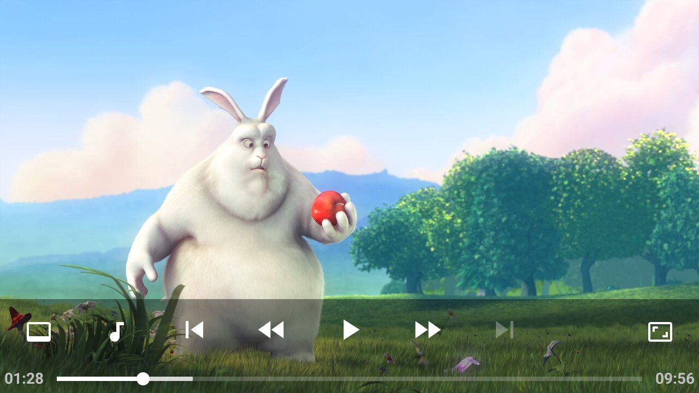

# Oxe
Oxe ("Exo" backwards) is a very simple Android media player based on [ExoPlayer]. It can play many different audio/video files,
or stream from the Internet (e.g. with [HLS]). Using the buttons it is possible to select between different video/audio/subtitle
tracks (e.g. different languages, or different resolutions/qualities).

**Note:** Oxe does not appear in the app overview. Instead, it is started via the native file manager or by "sharing"
a video/audio file with the app.

## Building
Oxe is a fairly standard Android Gradle project and can be built using `./gradlew clean build` (after providing the Android SDK location)
or using Android Studio.

## Example screenshot
> Note: [Big Buck Bunny] is available under [CC BY 3.0]: (c) copyright 2008, Blender Foundation / www.bigbuckbunny.org

[ExoPlayer]: https://github.com/google/ExoPlayer
[HLS]: https://en.wikipedia.org/wiki/HTTP_Live_Streaming
[Big Buck Bunny]: https://www.bigbuckbunny.org
[CC BY 3.0]: https://creativecommons.org/licenses/by/3.0/
